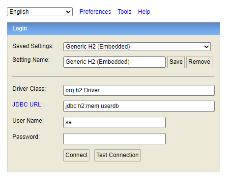
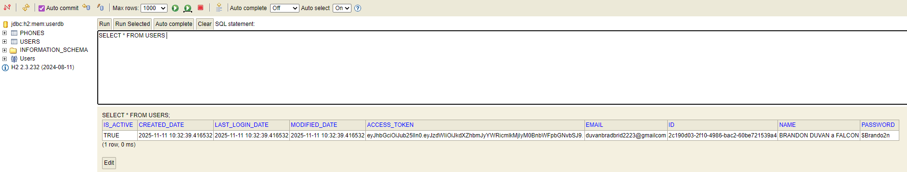

# API Registro de Usuarios

API REST desarrollada en **Java 21** con **Spring Boot 3.4.11**.

## Resumen
Permite la creación de usuarios guardanddo los datos personales 
con validación de email y contraseña.
- Utiliza una base de datos H2 en memoria.
- Validación de formato de email.
- Validación de formato de contraseña.

---

## Ejecución del Proyecto

### 1. Clonar el repositorio


```bash
git clone https://github.com/devduv/api-user-creation-bci
cd api-user-creation-bci
```

---

### 2. Compilar el proyecto con Maven

- Tener instalado JDK 21.
- Maven 3.9+

Ejecutar el siguiente comando:
```bash
mvn clean install
```

Generará el archivo `.jar` dentro de `target/`.

---

### 3. Ejecutar la aplicación

Puedes iniciar el proyecto con:

```bash
mvn spring-boot:run
```

también puede ejecutar el `.jar` generado:

```bash
java -jar target/pruebatecnica-0.0.1.jar
```

> Por defecto, la API se ejecutará en:  
> **http://localhost:8080**

---

### 4. Consultar servicio de registro de usuarios

#### POST /users/register

- Permite crear un usuario registrando el nombre, email, contraseña y números de celular, validando previamente que el correo no exista.

```curl
curl --location 'http://localhost:8080/users/register' \
--header 'Content-Type: application/json' \
--data-raw '{
    "name": "BRANDON DUVAN a FALCON",
    "email": "duvanbradbrid2@gmailcom",
    "password": "$Brandon3",
    "phones": [
        {
            "number": "1234567",
            "cityCode": "1",
            "countryCode": "57"
        }
    ]
}'
```

**Request Body:**
```json
{
  "name": "BRANDON DUVAN a FALCON",
  "email": "duvanbradbrid2@gmailcom",
  "password": "$Brandon3",
  "phones": [
    {
      "number": "1234567",
      "cityCode": "1",
      "countryCode": "57"
    }
  ]
}
```

**Response Body (Referencial):**
```json
{
  "id": "1d30b3e3-e6c9-4751-97d8-9755e082f475",
  "created": "2025-11-09T18:26:00.2087452",
  "modified": "2025-11-09T18:26:00.2087452",
  "last_login": "2025-11-09T18:26:00.2087452",
  "token": "string",
  "isActive": true
}
```

---
### 5. Base de Datos

El proyecto utiliza una base de datos **H2 en memoria**.

Los datos se almacenan temporalmente durante la ejecución y se eliminan al detener la aplicación.

- Acceso a la base de datos: http://localhost:8080/h2-console
- Completar con los siguientes campos:

  | Campo              | Descripción         |
  |--------------------|---------------------| 
  | **Driver class**   | org.h2.Driver       |
  | **JDBC URL**       | jdbc:h2:mem:userdb  |
  | **User Name**      | sa                  |
  | **Password**       | password            |

Configurable en el application.yml:

```yml
spring:
  datasource:
    url: jdbc:h2:mem:userdb
    username: sa
    password: password
    driverClassName: org.h2.Driver
  jpa:
    database-platform: org.hibernate.dialect.H2Dialect
  h2:
    console:
      enabled: true
```
---

---

- **Consultar usuarios en h2**

---

## Entidad: Usuario

Cada usuario registrado contiene la siguiente información:

| Campo               | Tipo de Dato  | Descripción                     |
|---------------------|---------------|---------------------------------|
| **id**              | UUID          | Identificador único del usuario |
| **name**            | String        | Nombre completo del usuario     |
| **email**           | String        | Correo electrónico del usuario  |
| **password**        | String        | Contraseña de usuario           |
| **created_date**    | LocalDateTime | Fecha de creación               |
| **modified_date**   | LocalDateTime | Fecha de modificación           |
| **last_login_date** | LocalDateTime | Fecha y hora del último ingreso |
| **access_token**    | String        | Token de acceso                 |
| **is_active**       | boolean       | Indicador de usuario habilitado |

## Entidad: Celular

Cada usuario registrado tiene una lista de celulares que contiene lo siguiente:

| Campo            | Tipo de Dato  | Descripción                     |
|------------------|---------------|---------------------------------|
| **id**           | UUID          | Identificador único del celular |
| **city_code**    | String        | Código de la ciudad             |
| **country_code** | String        | Código del país                 |
| **number**       | String        | Número del celular              |
| **user_id**      | String        | Identificador del usuarioo      |
---

## Contrato OpenAPI / Swagger

El contrato del API se encuentra disponible en:

- Archivo local: [`./openapi.yml`](./openapi.yml)  
- Documentación interactiva Swagger UI: [http://localhost:8080/swagger-ui/index.html](http://localhost:8080/swagger-ui/index.html)

---

## Property configurable
Para la validación del patrón de contraseña configurable en el application.yml:
```
password-pattern: ^(?=.*[A-Z])(?=.*\d)(?=.*[@$!%*?&._-])[A-Za-z\d@$!%*?&._-]{6,15}$
```

**Validaciones:**
- El **email** debe tener un formato válido (`usuario@dominio.com`).
- La **contraseña** debe cumplir con el patrón que es configurable (por ejemplo, mínimo 8 caracteres, una mayúscula, un número y un carácter especial).

---

## Diagrama de solución

---
## Desarrollador

**Brandon Duvan Saenz Falcon**  
Senior Java Developer | Contacto: duvanbradbrid@gmail.com

## Requisitos
Se cumplen los requisitos indicados:

- Responder el código de status HTTP adecuado.
- En caso de éxito, retorna los datos de  token, fecha y activo.
- En caso el correo exista en la base de datos, retorna un error 
- El correo se valida según expresión regular. 
- La clave se valida según expresión regular (configurable)
- El token es persistido junto con el usuario.
- Se usa H2, bd en memoria.
- Build en Maven.
- Persistencia con JPA.
- Proyecto desarrollado en Spring Boot.
- Java8+ (Se usó Java 21)
- Repositorio en Github.
- Readme.
- Diagrama
